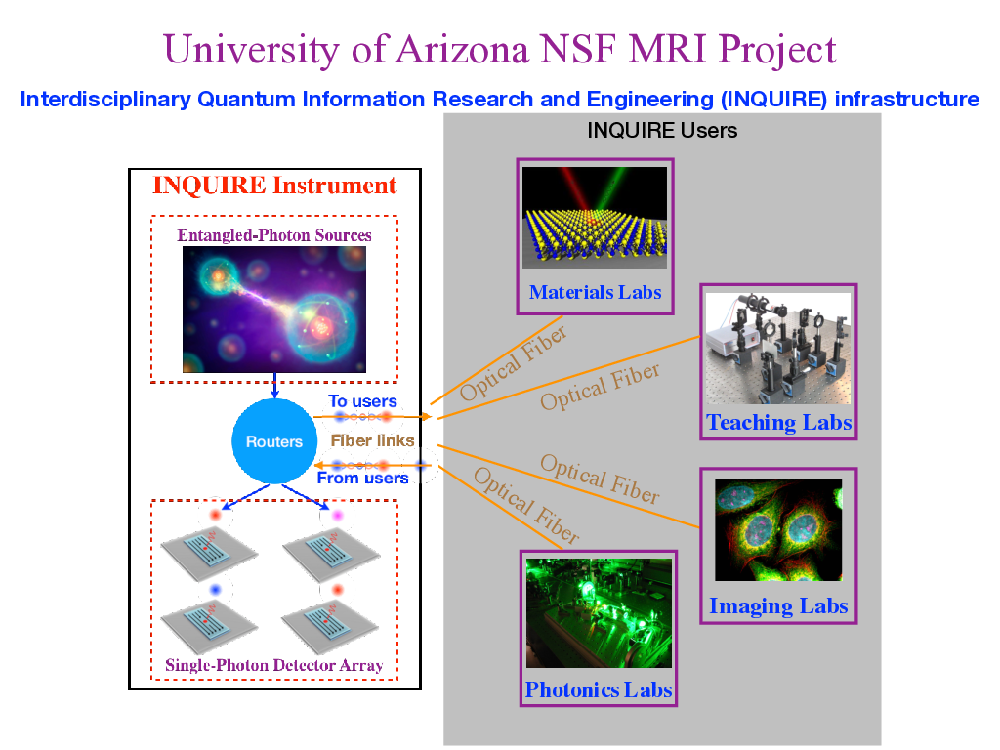

# Quagent: Quantum Agent
Quantum network local agency software (web operation software)


English | [简体中文](README_CN.md)



[](./LICENSE) []()  

[comment]: <> ([quagent &#40;Quantum Agent&#41;]&#40;https://quanlse.baidu.com&#41; is a cloud-based platform for quantum control developed by the [Institute for Quantum Computing]&#40;https://quantum.baidu.com&#41; at Baidu Research. Quanlse aims to bridge the gap between quantum software and hardware. It provides efficient and professional quantum control solutions via an open-source SDK strengthened by Quanlse Cloud Service.)
Quagent is the shorthand of "Quantum Agent", a universal operation software for application in Quantum Local Network. While it depends on some necessary hardware at the same time. Currently, the `qugent-v1.0.0` is has been 
used and tested in the series of experimental platforms of the [Center of Quantum Network](https://cqn-erc.org/) project at the University of Arizona. 


## Quagent v1.0.0

**Attention: We have added some exciting features and further improved the original ones in Quanlse v2.1. We strongly recommend users to upgrade to Quanlse v2.1!**


We have been trying to enrich and improve Quanlse's architecture. In this update, we have improved the fundamental modules in Quanlse in order to provide better user experience and support the modeling and simulation in lab frame. In superconducting platform, we have added the toolkit for qubit and readout calibration, and provided corresponding tutorials. we have also updated the noisy simulator, and added the two-qubit simulator, and two-qubit simulator with coupler architecture and some practical analysis tools.

## Install

We strongly recommend using [Anaconda](https://www.anaconda.com/) for your R&D environment and upgrading the requirements to the latest versions for the best experience.

### Install via pip

We recommend the following way of installing Quanlse with `pip`

```bash
pip install quagent
```

### Update

If you have already installed quagent, use the following code to update

```
pip install --upgrade quagent
```

### Download and install via GitHub

You can also download all the files and install Quanlse locally

```bash
git clone git@github.com:Youngcius/quagent.git
cd quagent
pip install -e .
```

### Run programs

Now, you can try to run a program to verify whether quagent has been installed successfully

[comment]: <> (```bash)

[comment]: <> (cd example)

[comment]: <> (python 1-example-pi-pulse.py)

[comment]: <> (```)

## Introduction and developments

### Overview

To get started with Quanlse, users are recommended to go through the [Overview](https://quanlse.baidu.com/#/doc/overview) firstly to acquire the whole picture of this platform. [Quick Start](https://quanlse.baidu.com/#/doc/quickstart) could then be a good place to guide you on how to use Quanlse Cloud Service step by step and how to construct your first program using Quanlse. Next, users are encouraged to learn more functions and applications from the [tutorials](https://quanlse.baidu.com/#/doc/tutorial-construct-ham) Quanlse provided. Finally, it would be great if users could solve their own problems using Quanlse. For complete and detailed documentation of the Quanlse API, please refer to our [API documentation](https://quanlse.baidu.com/api/).

[comment]: <> (### Tutorials)

[comment]: <> (Quanlse provides detailed and comprehensive tutorials from fundamental to advanced topics. Each tutorial currently supports reading on our [website]&#40;https://quanlse.baidu.com&#41;. For interested developers, we recommend them to download [Jupyter Notebooks]&#40;https://jupyter.org/&#41; and play with it. The tutorial list is as follows:)

[comment]: <> (+ **QuanlseSuperconduct**)

[comment]: <> (  + [Construct Hamiltonian]&#40;https://quanlse.baidu.com/#/doc/tutorial-construct-hamiltonian&#41;)

[comment]: <> (  + **Single-Qubit Control**)

[comment]: <> (    + [Single-Qubit Gate]&#40;https://quanlse.baidu.com/#/doc/tutorial-single-qubit&#41;)

[comment]: <> (    + [Optimize Pulses Using GRAPE]&#40;https://quanlse.baidu.com/#/doc/tutorial-GRAPE&#41;)

[comment]: <> (    + [Calibrate $\pi$ Pulse]&#40;https://quanlse.baidu.com/#/doc/tutorial-pi-pulse&#41;)

[comment]: <> (    + [Derivative Removal by Adiabatic Gate]&#40;https://quanlse.baidu.com/#/doc/tutorial-drag&#41;)

[comment]: <> (  + **Two-Qubit Gate Control**)

[comment]: <> (    + [iSWAP Gate]&#40;https://quanlse.baidu.com/#/doc/tutorial-iswap&#41;)

[comment]: <> (    + [Controlled-Z Gate]&#40;https://quanlse.baidu.com/#/doc/tutorial-cz&#41;)

[comment]: <> (    + [Cross-Resonance Gate]&#40;https://quanlse.baidu.com/#/doc/tutorial-cr&#41;)

[comment]: <> (  + [Quanlse Scheduler]&#40;https://quanlse.baidu.com/#/doc/tutorial-scheduler&#41;)

[comment]: <> (  + **Error Processing**)

[comment]: <> (    + [Error Analysis]&#40;https://quanlse.baidu.com/#/doc/tutorial-error-analysis&#41;)

[comment]: <> (    + [Randomized Benchmarking]&#40;https://quanlse.baidu.com/#/doc/tutorial-randomized-benchmarking&#41;)

[comment]: <> (    + [Zero-Noise Extrapolation]&#40;https://quanlse.baidu.com/#/doc/tutorial-ZNE&#41;)

[comment]: <> (  + **Noisy Simulator**)

[comment]: <> (    + [Single-Qubit Noisy Simulator]&#40;https://quanlse.baidu.com/#/doc/tutorial-single-qubit-noisy-simulator&#41;)

[comment]: <> (    + [Multi-Qubit Noisy Simulator]&#40;https://quanlse.baidu.com/#/doc/tutorial-multi-qubit-noisy-simulator&#41;)

[comment]: <> (    + [Two-Qubit Simulator with Coupler Architecture]&#40;https://quanlse.baidu.com/#/doc/tutorial-two-qubit-simulator-with-coupler-architecture&#41;)

[comment]: <> (  + **Qubit and Pulse Calibration**)

[comment]: <> (    + [Simulation of Readout Cavity Calibration]&#40;https://quanlse.baidu.com/#/doc/tutorial-readout-cavity-calibration&#41;)

[comment]: <> (    + [Single-Qubit Calibration]&#40;https://quanlse.baidu.com/#/doc/tutorial-single-qubit-calibration&#41;)

[comment]: <> (    + [Controlled-Z Pulse Calibration]&#40;https://quanlse.baidu.com/#/doc/tutorial-calibration-cz&#41;)

[comment]: <> (  + [Pulse-Based Variational Quantum Eigensolver Algorithm]&#40;https://quanlse.baidu.com/#/doc/tutorial-pbvqe&#41;)

[comment]: <> (+ **QuanlseTrappedIon**)

[comment]: <> (  + [Single/Two-Qubit Gate]&#40;https://quanlse.baidu.com/#/doc/tutorial-ion-trap-single-and-two-qubit-gate&#41;)

[comment]: <> (  + [General Mølmer-Sørensen Gate]&#40;https://quanlse.baidu.com/#/doc/tutorial-general-MS-gate&#41;)

[comment]: <> (+ [QuanlseNMR]&#40;https://quanlse.baidu.com/#/doc/nmr&#41;)

## Feedbacks

Users are encouraged to contact us through [Github Issues](https://github.com/Youngcius/quagent) or zhy@email.arizona.edu with general questions, bugs, and potential improvements. We hope to make quagent better together with the community!

## Frequently Asked Questions

**Q: How should I get started with Quanlse?**

**A:** We recommend users go to our [website](http://quanlse.baidu.com) and follow the roadmap. 

- **Step 1:** Go to [Quick Start](https://quanlse.baidu.com/#/doc/quickstart) to learn how to access Quanlse Cloud Service.
- **Step 2:** Get familiarized with Quanlse by going through the examples of [Single-Qubit Control](https://quanlse.baidu.com/#/doc/tutorial-single-qubit) and [Two-Qubit Control](https://quanlse.baidu.com/#/doc/tutorial-iswap). 
- **Step 3:** Explore more possibilities with Quanlse by studying more advanced applications, such as [Quanlse Scheduler](https://quanlse.baidu.com/#/doc/tutorial-scheduler), [Error Processing](https://quanlse.baidu.com/#/doc/tutorial-error-analysis), [Noisy Simulator](https://quanlse.baidu.com/#/doc/tutorial-multi-qubit-noisy-simulator), [Two-Qubit Simulator with Coupler Architecture](https://quanlse.baidu.com/#/doc/tutorial-two-qubit-simulator-with-coupler-architecture), [Qubit and Pulse Calibration](https://quanlse.baidu.com/#/doc/tutorial-readout-cavity-calibration) and [Pulse-based Variational Quantum Eigensolver Algorithm](https://quanlse.baidu.com/#/doc/tutorial-pbvqe).

**Q: What should I do when I run out of my credit points?**  

**A:** Please contact us on [Quantum Hub](https://quantum-hub.baidu.com). First, you should log into [Quantum Hub](https://quantum-hub.baidu.com), then enter the "Feedback" page, choose "Get Credit Point", and input the necessary information. Submit your feedback and wait for a reply.

**Q: How should I cite Quanlse in my research?**  

**A:** We encourage developers to use Quanlse to do research & development in the field of quantum control. Please cite us by including [BibTeX file](Quanlse.bib).


Quanlse uses [Apache-2.0 license](LICENSE).

## References

[1] [Quantum Computing - Wikipedia](https://en.wikipedia.org/wiki/Quantum_computing).


[comment]: <> ([1] [Quantum Computing - Wikipedia]&#40;https://en.wikipedia.org/wiki/Quantum_computing&#41;.)


