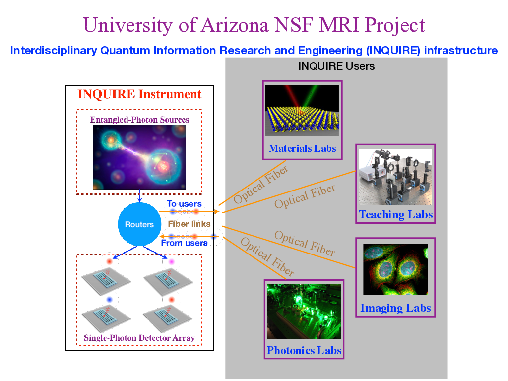
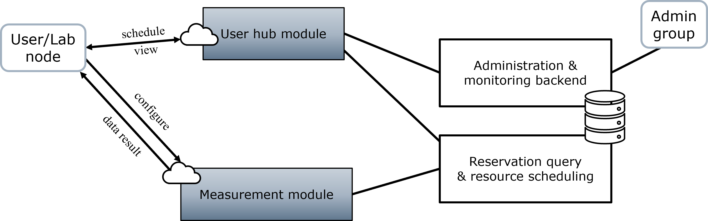

# Quagent: Quantum Agent

Quantum network local agency software (web operation software)

English | [简体中文](README_CN.md)


[](./LICENSE) []()  

Quagent is the shorthand of "Quantum Agent", a universal operation software for application in Quantum Local Network.
While it depends on some necessary hardware at the same time. Currently, the `qugent-v1.0.0` is a development plan
aiming to facilitate multi-access research and teaching on quantum information experiments, initially for the demand
of the National Science Foundation (
NSF) [Major Research Instrumentation (MRI) #1828132](https://www.nsf.gov/awardsearch/showAward?AWD_ID=1828132&HistoricalAwards=false)
award project. This operation software will be hopefully applied to the series of experimental platforms of
the [Center of Quantum Network](https://cqn-erc.org/) at the University of Arizona. Our final goal is to provide a
universal technical prototype for quantum networks in terms of the local agent terminal.



## Quagent v1.0.0

We have been trying to enrich and improve Quagent's architecture.

**Framework**:

1. Application cases: Native control with only Quagent, or co-operation with Agilent [iLab](https://ua.ilab.agilent.com)
   operation software
3. Functionalities: entangled photons and detected photons routing, real-time measurement of photons and data
   acquisition, resources reservation and allocation by time
4. Soft-Hardware interface: serial communication for optical switches, Time Tagger API,
5. Hardware Platform: 5 type of Entangled-Photon Sources channels (Entangled-Photon Sources generation experimental
   platform), 8 Single-Photon Detector channels (Superconducting Nanowire Single-Photon Detector), 5x16 optical/fiber
   switches, 8x8 optical/fiber switches

More details could be found in the [manual](./static/doc/manual.md) for reference of developers.

## Usage

### Native Usage via only Quagent at U Arizona

Quanget itself provides a complete set of functionalities, including user registration, laboratory grouping, resource
management, usage configures, data acquisition and real-time administrative monitoring and so on. The included
self-contained database models and port mapping logics of Quagent ensures these functionalities and their interation. 
What one user shall care is just the hardware configuration of
the laboratory he/she belongs to. After (registration and) login, the user can handle well with the user-friendly Web
interface without much guidance.




A practical usage instance is described in the [design document](./static/doc/design.md) for reference.

### Usage via Agilent iLab operation software at U Arizona

Although Quagent can run independently in some internal laboratories at the University of Arizona, it is actually a
technical prototype but not a released business software. And the independent project "Quanget" is mainly aimed to
develop and test continuously. In the stable application scenarios of U Arizona, Quagent is integrated with iLab
operation software supported by Agilent Inc. Thus if you are a supported user of the iLab system of U Arizona, you can
begin to use it conveniently via iLab.


A demonstrative [video](static/doc/Demonstration%20-%20Quantum%20Network%20Testbed.mp4) is for reference.

### Download and install via GitHub

For development and research necessity, downloading the last universal prototype software is from GitHub.

```shell
git clone git@github.com:Youngcius/quagent.git
```

## Feedbacks

Users are encouraged to contact us through [Github Issues](https://github.com/Youngcius/quagent) or
zhy@arizona.edu with general questions, bugs, and potential improvements. We hope to make quagent better together
with the community!

## Frequently Asked Questions

**Q: Where should I get to know more about Quagent?**

**A:** The [NSF MRI #1828132](https://www.nsf.gov/awardsearch/showAward?AWD_ID=1828132&HistoricalAwards=false) award
project description is a good illustration. You can also refer to our [design document](static/doc/design.md)
and [user manual](static/doc/manual.md) for more support.
If you have more demand or cooperation willingness, please contact to
the [Quantum Information and Materials Group](https://quantum.lab.arizona.edu) of U Arizona.

**Q: How can I get to start Quagent if I am faculty or student of U Arizona?**

**A:** You can contact ot related people at U Arizona or get more information from
the [corresponding website](https://ua.ilab.agilent.com/landing/3645).

**Q: Can I use Quagent via iLab if I am not a faculty or student in U Arizona?**

**A:** Quagent is not a pure-software application. It's framework and application scenarios are closely dependent on
corresponding hardware platforms. Currently it is applied to the serial systematically linked laboratories of U Arizona.
So if you are not a person in U Arizona, there is no necessity for you to use it. But if you are a researcher in related
fields, you can build your own hardware supports and modify Quagent accordingly if possible.

## Copyright and License

Quagent uses [Apache-2.0 license](LICENSE).

