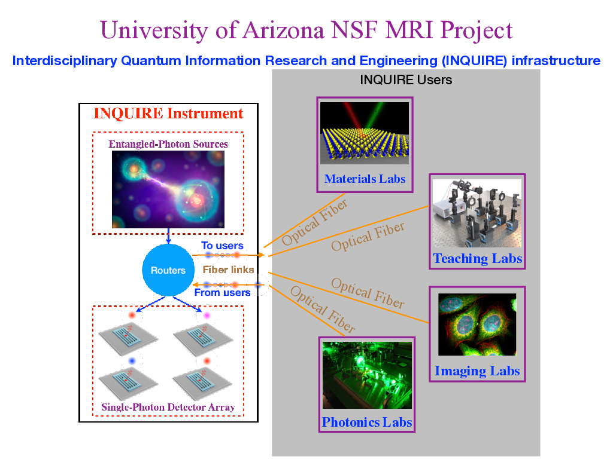
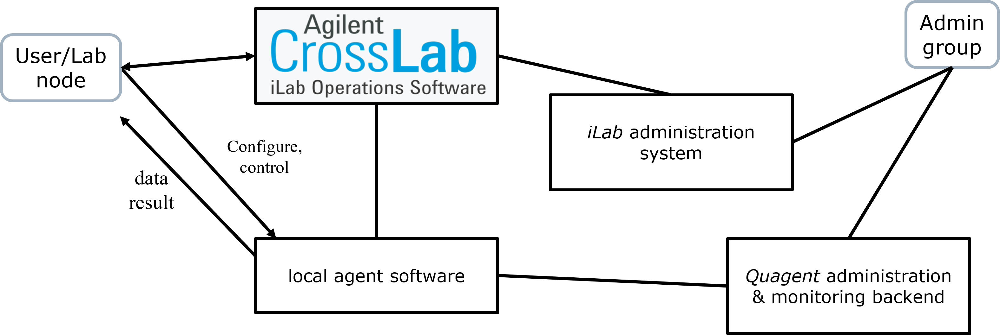

# Quagent: Quantum Agent

局域量子网络本地端 Web 控制系统

[English](README.md) | 简体中文


[](./LICENSE) []()  

Quagent (Quantum Agent) 是一个用于量子局域网络 (Quantum Local Agent) 是通用操作软件。
然而 Quagent 的正常运行和使用依赖于必要的硬件平台。目前的 `quagent-v1.0.0` 是一个基于
美国科学基金 [MRI #1828132](https://www.nsf.gov/awardsearch/showAward?AWD_ID=1828132&HistoricalAwards=false)
项目需要的开发计划，是为其中所提到的协议的软件实现部分，
旨在促进多用户访问的量子信息交叉学科实验的研究和教学。该 Web 软件有望
应用在连接到[亚利桑那大学量子网络中心](https://cqn-erc.org/) 的更多实验平台。我们的最终目标是在在量子网络的本地终端代理方面提供一个通用完善的技术原型。



## Quagent v1.0.0

我们一直致力于丰富并完善 Quagent 的架构。

**框架设计**

1. 应用场景：对接到 Agilent [iLab](https://ua.ilab.agilent.com) 的[亚利桑那大学量子网络中心](https://cqn-erc.org/)实验资源共享和访问
2. 主要功能：纠缠光子和探测光子的路由转发，光子探测和实时数据获取，仪器资源按时预定和分配
3. 软硬件接口：用于控制光纤光学交换机的串口通信，控制 Time Tagger（时序计数器）的 API
4. 硬件支持：5 种类型的纠缠光子源通道（背后是一个产生纠缠源的实验平台），8 个单光子探测器通道（背后是一个超导纳米线单光子探测器），5x16 接口的光纤光学交换机，8x8 接口的光纤光学交换机

## 使用

### 仅依赖亚利桑那大学 Quagent 的本地使用

Quanget 本身提供了一套完整的操作支持，包括用户注册、实验室分组、资源管理、使用配置、数据获取、实时的后台状态监控等功能。Quagent 内部的
数据库模型和端口映射逻辑确保了这些功能及其之间的交互。在使用中，用户仅需要考虑其所属实验室的硬件上的连接状态。在（注册和）登录了 Quagent 之后，
用户便能在其中的 Web 交互界面很方便地自主操作。


本项目的[使用手册](./static/doc/manual.md)中包含实际场景的使用例程可供参考。

### 通过亚利桑那大学校内的 Agilent iLab 操作软件访问

尽管亚利桑那大学内部实验室能够直接使用 Quagent，
但它实际上是一个技术原型，而不是一个成熟发行的商业软件。
独立项目“Quagent”的主要目标是持续开发和测试。
事实上，Quagent 通过 Agilent iLab 开放的 Web API 与其集成，作为 Agilent iLab 中一个持续可用的第三方支持模块。
因此，如果您是亚利桑那大学 iLab 系统的受支持用户，您可以通过 [iLab](https://ua.ilab.agilent.com) 方便地开始使用它。



本项目的一个[演示视频](static/doc/Demonstration%20-%20Quantum%20Network%20Testbed.mp4)可供参考。

### 通过 GitHub 下载安装

用户可以通过 GitHub 下载全部文件后进行本地安装

```bash
git clone http://github.com/Youngcius/quagent
```

## 反馈

我们鼓励用户通过 [Github Issues](https://github.com/Youngcius/quagent/issues) 或 zhy@email.arizona.edu
联系我们反馈一般问题、错误和改进意见和建议。我们希望通过与社区的合作让 Quagent 变得更好！

## 常见问题

**Q: 我应该如何开始使用 Quagent？**

**A:** [NSF MRI #1828132](https://www.nsf.gov/awardsearch/showAward?AWD_ID=1828132&HistoricalAwards=false) 项目
对 Quagent 的最初行业目标有着较清晰的描述。您也可以参考我们的[设计文档](./static/doc/design.md)以及[使用手册](./static/doc/manual.md)获取更多所需信息。
如果您有更进一步的使用需求，请联系亚利桑那大学 [Quantum Information and Materials Group](https://quantum.lab.arizona.edu) 实验室获取支持。

**Q: 如果我是亚利桑那大学的师生，我应该如何支持使用 Quagent？**

**A:** 您可以联系亚利桑那大学内的[相关机构](https://ua.ilab.agilent.com/landing/3645)获取支持。

**Q: 如果我不是亚利桑那大学的师生，我应该如何支持使用 Quagent？**

**A:** Quagent 并不是纯软件级的应用。他的设计框架和应用场景目前依赖于亚利桑那大学的一系列硬件平台之上。目前亚利桑那大学中连接到
其量子网络中心（hub）的终端实验室才能使用 Quagent。如果您并不是亚利桑那大学的师生，您并没有实际使用的必要。如果您是相关行业的研究人员，您
可以下载 Quagent 项目，并对其修改使其适配于自己的硬件平台。

## 版权和许可证

Quagent 使用 [Apache-2.0 license](LICENSE) 作为许可证。