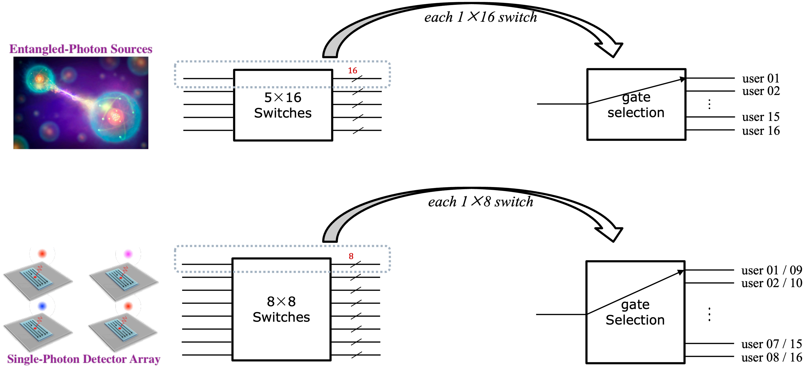
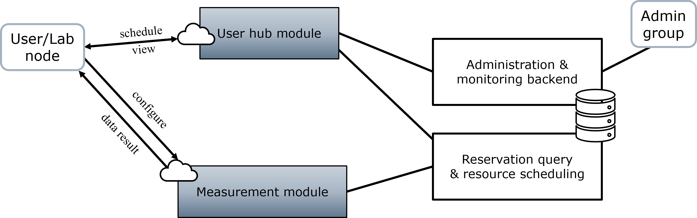

# Systematic Design of Quagent

> Last updated: June, 2022<br>
> Editor: [Zhaohui Yang](https://youngcius.com) (zhy@arizona.edu)


## Hardware Layout

### Quantum Network Layout

The following figure shows which laboratories (nodes) are connected to the central service (hub) that generate entangled
photons and receive photons to detect.


Although Quagent can support 16 terminal users, i.e., 16 laboratories or 16 nodes, currently there are 13 nodes totally,
connected directly to subhubs respectively.

### Current Hardware Resources

- high-quality Entangled-Photon Sources (EPSs or EPs) in terms of telecom-wave entangled photons
- 5×16 & 8×8 fiber switches (routing control)
- 1 Superconducting Nanowire Single-Photon Detector (SNSPD or SPD) providing 8 detecting channels
- 1 Time Tagger (ultimate counting device with 8 channels)

### Channel Linkage with Fiber Switches

As for the connection capability of our platform, obviously it can support maximum 16 user nodes (16 lab platforms),
each with 5 EPS channels and 4 SNSPD channels linked to fiber switches. While currently there is 13 built laboratory
nodes in
the quantum network at University of Arizona.



This network status figure demonstrates that, in the meantime, there are at most 5 nodes occupy the entangled-photon
source channels, and at most 8 nodes occupy the single-photon detector channels, which are supported by the 5x16 fiber
switches and 8x8 fiber switches, respectively.

## Front-end & Back-end Technologies

Unlike a classic Web or Web-based software, dominant points of our system lie in the back-end logic and other supporting
technologies like data visualization.

### Choices & Considerations

- Django: A popular back-end business framework based on Python
- ECharts: A powerful, interactive charting and visualization library for browser, base on JavaScript
- MySQL: Most popular open-source relational database management system
- Axios: Asynchronous request tool library of AJAX
- Semantic UI: A development framework that helps create beautiful, responsive layouts using human-friendly HTML
- Simple UI: A user-friendly administrative UI framework than native backstage UI of Django


Django is a high-level Python web framework that encourages rapid development and clean, pragmatic design. We use Django
framework to support functionalities of HTTP requirements and responses, database operation and real-time monitoring. In
our software, users are provided by a series of friendly interfaces including configuring user-specific parameters of
connected devices as well as real-time data acquisition. Particularly, data acquired by the counting device could be not
only easily shown on the Web dashboard, but real-timely downloaded to users, in form of JSON files.

Apache ECharts is a free, powerful charting and visualization library offering an easy way of adding intuitive,
interactive, and highly customizable charts to serial commercial products. It is natively written by JavaScript, while
it also provides easy-to-use interfaces for Python. The latter is what we mainly used in Quagent, since in this way data
visualization programs can be natively embedded in back-end business logic codes.Specifically, In the `monitor` module,
JavaScript-based ECharts library is used to implement geographical information visualization, integrated with Google
Maps APIs. In the `acquire` module, the series of measurement results are shown via Python-based PyECharts, in forms of
Histogram, Count Rate and other types of figures. This is taken into account to for more convenient when writing
back-end processing logics.

MySQL is the most popular relational database management system at present. It is widely used in small and medium-sized
websites on the Internet. It has the advantages of small volume, fast speed and low overall cost of ownership. This
project involves multiple data tables. MySQL is a good choice. In fact, only on the final distribution stage we will use
MySQL. While in the development and testing stage, we just use the built-in database SQLite of Django, just for
convenience.

Asynchronous requesting and local refreshing are absolutely necessary for Web programs in real scenarios. AJAX (
Asynchronous JavaScript and XML) is a standard and web development technique to realize this. While Axios is a
JavaScript library that helps developers use AJAX easily, or, it is a "promise"-based encapsulation of AJAX. In our
project, functions of Axios library are used in HTML pages to acquire data forms updated by users, which are then sent
ot back-end views functions.

Semantic UI a full semantic-designed front-end framework. Due to its ease of use, flexibility and abundant documents and
examples support, it is chosen to beauty the front-end profile.

The administrative program of Quagent use SimpleUI to implement a more fashion interface. It is easily embedded in this
software by some additional configurations in the setting program of Quagent.

## Software Architecture


This software consists of five modules in the back-end:

- `main`: home page representation and user registration/login
- `hubinfo`: information query and resource scheduling, as the first step for users' operation
- `acquire`: user-specific measurement configuration and data acquisition
- `monitor`: part of back-end management system, including real-time network status visualization building on maps
- `foreign`: interface connected to iLab Web API

All the five modules are constructed by Django application creation standards.


For the front-end, Quagent consists of three front-end operation pages:

- Home: the home page, for user registration/login
- DataAcquire: real-time measurement page, supporting six measurement modes
- UserHub: resources configuration and operation page


### 1. `main` module

This module is the simplest one. Three functionalities are consisted in it. They use the same
template to represent main page information.

- Home page: directed to the main page of Quagent
  
- User login: if there is no user having logining, user can login with existing one's username and password
  
- User registration: A new visitor can firstly register a valid account and then login Quagent via this page,
  since subsequent operations require a valid user having logining. A new visitor must select one of supported
  laboratories and fill out its unique invitation token (20 characters) to register successfully.
  

### 2. `acquire` module


This module provides user-specific measurements, with optional six measurement modes. Examples are as follows.


Two points are particularly taken into consideration to implement
it: 1) *global variable* presenting the unique but shared hardware resources, e.g., Time Tagger; 2) abstract
*user-specific measurement instances* providing non-conflicting measurement settings and data acquisition operations.

For the first point, a source file `globvar.py` is maintained in this module, whose inner initialized variables might be
called by other views functions.

```text
acquire
├── __init__.py: in this script, global variable "tagger" gets initialized by Swabian TimeTagger API
├── measurement
│   ├── strategy.md
│   ├── views_correlation.py
│   ├── views_countbetweenmarkers.py
│   ├── views_counter.py
│   ├── views_histogram.py
│   ├── views_startstop.py
│   └── views_timedifferences.py
├── admin.py: built-in module, automatically generated by Django
├── apps.py: built-in module, automatically generated by Django
├── globvar.py: global variables, like "tagger" and serial dynamic dictionary data consisting of user-specific measurement cases 
├── models.py: built-in module, automatically generated by Django, in which we define the UserDetector class
├── urls.py: routing function
├── utils.py: a set of directed utility functions for this module
└── views.py: view functions, as processing implementation of routing functions from urls.py
```

For the second point, it is realized based on related data structure and global dynamic variables. We define
the `UserDetector` class to present one specific user-measurement pair.

```python
import TimeTagger as tt


class UserDetector:
    """
    Pair of one User and one Measurement instance
    """
    detector_types = ['Counter', 'CountBetweenMarkers',
                      'StartStop', 'Correlation',
                      'TimeDifferences', 'Histogram']

    def __init__(self, username: str, mode: str):
        """
        Initialize object, set its username and measurement mode
        """
        self.username = username
        if mode not in self.detector_types:
            raise ValueError('{} is not a supported measurement mode'.format(mode))
        else:
            self.mode = mode
        self.detector = None
        self.config = None

    def create_detector(self, tagger: tt.TimeTagger):
        """
        :param tagger: Time Tagger instance
        """
        if self.config is None:
            raise ValueError('You should set UserDetector.config property before creating it detector instance')
        self.detector = getattr(tt, self.mode)(tagger, **self.config)

    def set_measure_config(self, **kwargs):
        """
        Set configuration parameters for its specific measurement mode
        """
        self.config = kwargs
```

To maintain dynamic updating of user-specific measurement cases, six global variables corresponding to six measurement
modes, named `usr_<detector mode>_map` (`dict` data type in Python) are pre-defined in `globvar.py` file.

```python
user_cnt_map = {
    'u01': user_counter,  # UserDetectorinstance
    'u02': ...,
    ...
}
user_corr_map = {
    'u01': user_correlation,  # UserDetector instance
    'u02': ...,
    ...
}
usr_cbm_map = ...
usr_hist_map = ...
usr_stsp_map = ...
usr_tmdiff_map = ...
```

### 3. `hubinfo` module

This module is for users to review their personal information, configure parameters and book instrument resources.
As mentioned above, each effective lab are connected with ECE hub via 4 SPD channels
and 5 EPS channels. It is in this module most data models are defined anc configured initially once Quagent begins
to run.

**user & laboratory management**

Logically, Quagent supports 16 "groups" corresponding 16 "laboratories", respectively. A valid "user" must
belong to one of them when created. For the convenience of testing, Quagent initialize 16 users (u01, ...., u16) for
every laboratory, as the following figure.


To implement this, three data models are used: `User`, `Group` and `Laboratory`. The former two are built-in models
in Django, which providing user entity management and permission management functionalities, respectively. 'Laboratory'
defined in `quagent/hubinfo/models.py` file. From the back-end administration page the included data fields
of `Laboratory` can be seen. Particularly, the field `token` is generated by "uuid" in Python when the `Laboratory`
instance are created.


**user-resource linkage channels**

According to the fiber channel/port mapping relationship between users and ECE hub, two database models are constructed
in Quagent: `EPsLinks` and `SPDsLinks`. They describe real-time linkage status of two fiber switches, with the same data
fields but different value domains. For example, four data fields of `EPsLinks` are:

- `lab`: the built-in `Laboratory` instance,
- `in_ch`: index of the channel connected to the Entangled-Photon source platform
- `out_ch`: index of the channel connected to the user terminal
- `linkage`: whether the fiber switch changes to this link identified by (`in-ch`, `out_ch`) pair
- `in_use`: whether the linkage is used in field (not all links whose `linkage` are True are used by users)

Each tuple of the four data fields represents a fiber link for Entangled-Photon distribution. As the hardware-level
setting, there are totally 80 tuples, i.e., 80 records of the table. When `linkage` is `False`, the `in_user` field must
be `False`, meaning the channel is not in use when it is not connected; when `linkage` is `True`, `in_use` might
be `True` but not necessarily. Since there are always 5 channels are connected, we use two fields (`linkage`, `in_use`)
to distinguish whether a channel is actually in use. Similarly, the role of `SPDsLinks` represents a data table
recording all links status of the 8*8 fiber switches.


When Quagent is firstly installed on one platform, the two database tables will be initialized by two text
files `eps.csv` and `spd.csv` that are pre-generated by a script and are located in `static/data/` folder. In the
80 `EPsLinks` (and 64 `SPDsLinks`) records, only 5 (and 8) data fields `linkage` are `True`. While all the `in_use` data
fields are `False`. It means an initial status. Then two switches will change their connections to corresponding
channels. That is how Quagent initialize status of all the switches links.

The following figure is a resource configuration example, in which two EPS channels (1, 3) and two SPD channels (1, 2)
are linked and in use.


**resource reservation**

Time-based resource scheduling is another important functionality of `hubinfo` module. This process depends
on user's booking/releasing actions and Quagent's back-end reservation query and resource allocation logics. All situations
that might lead to conflict are considered by the interactive logic.

One user can easily request EPS or SPD resource in the "UserHub" page as the above figure shows. One should designate the
booking time period, which shall between 10 and 120 minutes in 7 days. The back-end program whether a new request
conflict with any existing reservations in database. Once there is no conflict, a new reservation will be constructed
and two timers (allocation & releasing) are initialized. A continuous reservation database query program runs
periodically (the current period setting is 10 minutes), which is implemented by `hubinfo/query.py`. Once a reservation
to process is queried, the user will receive a reminder email. Once the scheduled time is reached, the user can see that
the resource is available in "UserHub" page. The user can see how much time left for usage in the "Time remaining"
column. He/she can also release the resource actively before the original reservation expiring, which is a good operation.

It is noteworthy that although the reservation record are user-specific, practical resource scheduling will firstly 
distinguish which lab the user belongs to. That is, the entire scheduling process integrates user-specific and lab-specific 
two modes.

### 4. `monitor` module

This module facilitates the administrator to view the real-time fiber network status, i.e.,
who are using EPs or SPDs links. Since detailed linkage status are demonstrative by the built-in
database views automatically integrated in the administrative page. Currently, the `monitor` module only provide
real-time maps monitoring functionalities, which is algo manually integrated in the administrative page.


Like the above figure shows, red circles presents that entangled photons are flowing from ECE hub to terminal labs, and
purples circles shows that photons to be detected are flowing from terminal nodes to ECE hub. A node is active only when
the `linkage` and `in_use` two data fields are both `True`.

### 5. `foreign` module

Quagent can realize time-based resource reserving by itself, but for real-scenario usage, more supports need to be
considered.
For example, facilities usage requires charge. For another consideration, it is better to be integrated with the
existing instruments sharing
platform currently. In that way more accounts and laboratories information can be utilized conveniently. Currently,
UArizona use a
CrossLab (iLab), a mature solution in this field. Here int the steps about how to dynamically allocate/release
instrument resources
for users based on their reservation data from iLab.

- Query recent reservation data via iLab Web API every a fixed anticipated interval. For instance, if the interval is 15
  minutes, user's reservations cannot be changed if current time is less than 15 minutes from the usage appointment.
- If there is any reservations in this anticipated interval, calculate the specific time interval from its appointment
  time.
- For such a reservation in the anticipated interval, two timers (for allocating and releasing resources, respectively)
  are created and will be triggerred in corresponding time intervals.

Usually, the period of such a query loop is equal to the fixed interval, e.g., 10 minutes. Quagent will also send
reminder emails to
users once their reservations is less than the anticipated interval from the usage appointments when queried. Because
the applicable
reservations on iLab are non-flict ordered, as long as Quagent querying and allocating/releasing operations in order,
the scheduling process will not occur conflict in
resources allocation.

Since 16 terminal nodes corresponds to 16 user groups, for one user logining into Quagent, Quagent will distinguish
which laboratory he/she
belongs to and perform an internal logining operation. The desirable loging approach is connecting Google Gmail account
logining API, since the
fundamental email system of UArizona NetID is exactly Gmail. As for the mapping relationships between users and
laboratory groups, they can be
acquired from iLab in advance.


## Scheduling Strategy of Quagent

### Native usage



As described above, Quanget itself provides a complete set of functionalities, including user registration, laboratory grouping, resource
management, usage configures, data acquisition and real-time administrative monitoring and so on. The operation logics described in the
above sections can be summarized by the following figure. What the user needs to consider are only configuring EPS and SPD 
resources and performing the real-time detecting experiments. For the manager, one can login the administration page to 
monitor resources usage status and check all database records.

### Usage via Agilent iLab


The internal scheduling strategy has been described previously, which corresponds the connection between "iLab
Operations Software" and
"Local Agent Software" two parts in the figure above. For users, what they are directly exposed are also just the two
parts.
Both parameter configuration and data acquisition are finished in a consistent manner. That is, other components in the
above figure are
transparent to users.

For detailed operations, a demonstrative [video](../doc/Demonstration%20-%20Quantum%20Network%20Testbed.mp4) is for reference.
And the [manual document](manual.md) illustrates how users conduct an entire quantum experiment only using this local
Quagent software.


