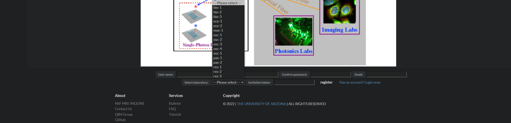
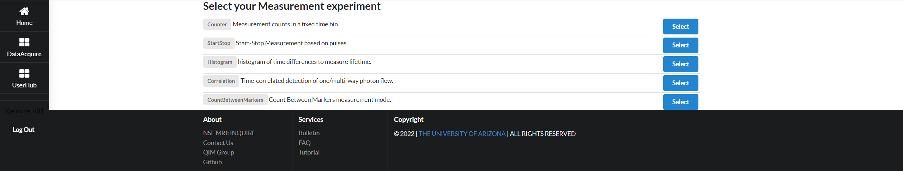

# User Manual

> Last updated: June, 2022 
> Editor: [Zhaohui Yang](https://youngcius.com) (zhy@email.arizona.edu)

In comparison with the [design document](design.md), this manual describes more superficial and more detailed content.
Or, the manual focuses more on the front-end interactive manners.

A [video](../doc/Demonstration%20-%20Quantum%20Network%20Testbed.mp4) will give users an intuitive impress about how to
use Quagent. Although this video describes the usage mode via Agilent iLab, it does give some guidance. Below the manual
mainly covers the usage mode via only Quagent.

## User Registration and Login

The registration/login part is easy to handle for any users. Information required when registering a new account are as
the following figure. While some points needs to notice:

- password: it should consists of more than 6 characters
- email: a registration reminder email will be sent to the email address if it is valid
- laboratory: user must select one of 16 laboratories (in fact there 13 valid laboratories, addictive three are
  reserved), since Quagent only provides for supported laboratory members
- token: a string including 20 characters, used to ensure the laboratory identity; a new user to register should contact
  his/her laboratory's principal investigator (PI) or Quagent's administrator to acquire it

## Resource Reservation

### EPS and SPD resources

As settings, one lab are connected to 4 Superconducting Nanowire Single-Photon Detector (SNSPD or SPD) channels and 5
Entangled-Photon Source (EP or EPS) channels. There is not any difference among the 4 SPD
channels. While 5 EPS channels provides different types of entangled photons ultimately from two EPS generation
experimental platforms.

- EPS channel 1: "signal" photon, from the 1st EPS generation platform
- EPS channel 2: "idler" photon, from the 1st EPS generation platform
- EPS channel 3: "sync" photon, from the 1st EPS generation platform
- EPS channel 4: "spontaneous parametric down-conversion (SPDC)" photon, from the 2nd EPS generation platform
- EPS channel 5: "spontaneous parametric down-conversion (SPDC)" photon, from the 2nd EPS generation platform

### User configuration page

**1. apply**

Any request should designate the desirable reserved time period, between 10 and 120 minutes
in 7 days. The back-end query program can ensure that any user with valid reservation to process will
receive a reminder email no more than 10 minutes before the reservation beginning.

**3. release**

The "Release" or "Release All" button means actively releasing channels before the specific reservation
expiring. Otherwise, a back-end timer will be triggered to release the channel at the end of the
reservation period.

## Real-time Measurement

The measurements are user-specific and non-conflict. Thus, it supports multiple users from the same laboratory
or different laboratories to perform their specific measurement experiments. It is noteworthy that the response might
not be timely when there are multiple users' detecting requests. This untimeliness lies in the Web rendering and
back-end threads processing. The further reasons might lie in the limited host processing capability or the Web programs
implementation approaches, which will be optimized in the next version.

## Administrative Monitoring

Two kinds of functionalities are provided in this part:

- View/Edit any database records
- Monitor the real-time fiber network usage status building on embedded Google Maps

Although the administrator can modify any database record via the administrative page, it is significant only when
modifying `User`, `Group`, `Laboratory` and `Resercation` information. Instead, modifying the EPs or SPDs linkage status
is trivial and not suggested.

## Real-scenario Examples

Herein some real-scenario examples helps demonstrates how to use Quagent and how to monitor the back-end data or status.

**1. User requesting resources**

Suppose one user whose username is "u01" has successfully requested EPS-channel-1, EPS-channel-3, SPD-channel-1 and
SPD-channel-2. The
administrator can see these reservations.

Once the reserved beginning time is reached, the administrative page will show these corresponding channels for "u01"
are linked and ins use.

The maps will show dynamic connection nad operations.

In the front-end "UserHub" page, the user can see these available channels and how much time remaining.

**2. User performing measurements**

Now "u01" can select the measurement mode(s) he/she needs from the six optional ones.
For each measurement mode, optional channels are those in use and displayed in the "UserHub" page.

Each of them are demonstrated by the following example figures. Users can refer
to [Swabian's documentation](https://www.swabianinstruments.com/static/documentation/TimeTagger/api/Measurements.html)
to learn how to configure these parameters.

- Counter
  
- StartStop
  
- Histogram
  
- Correlation
  
- CountBetweenMarkers
  

Particularly, the user can set a time interval to wait and then acquire the real-time origin data in format of JSON.

